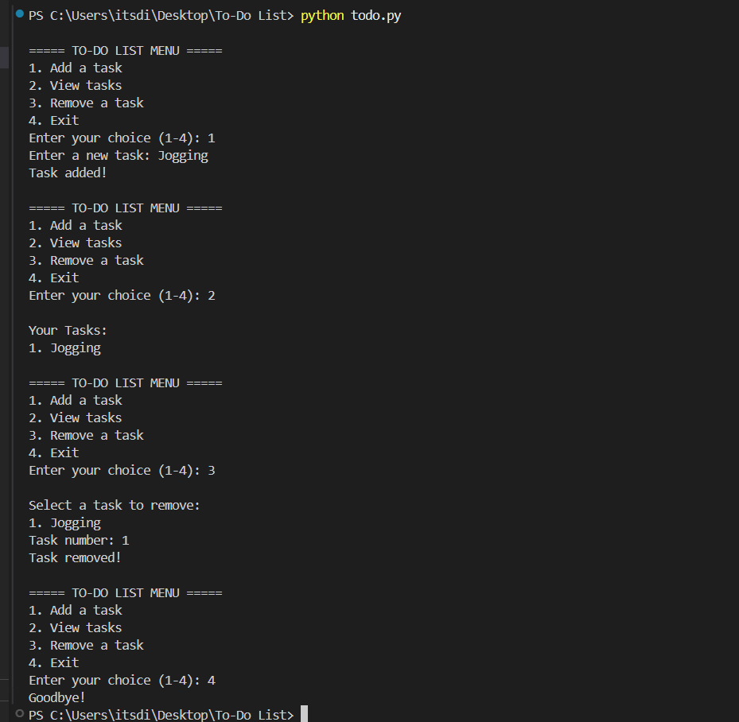
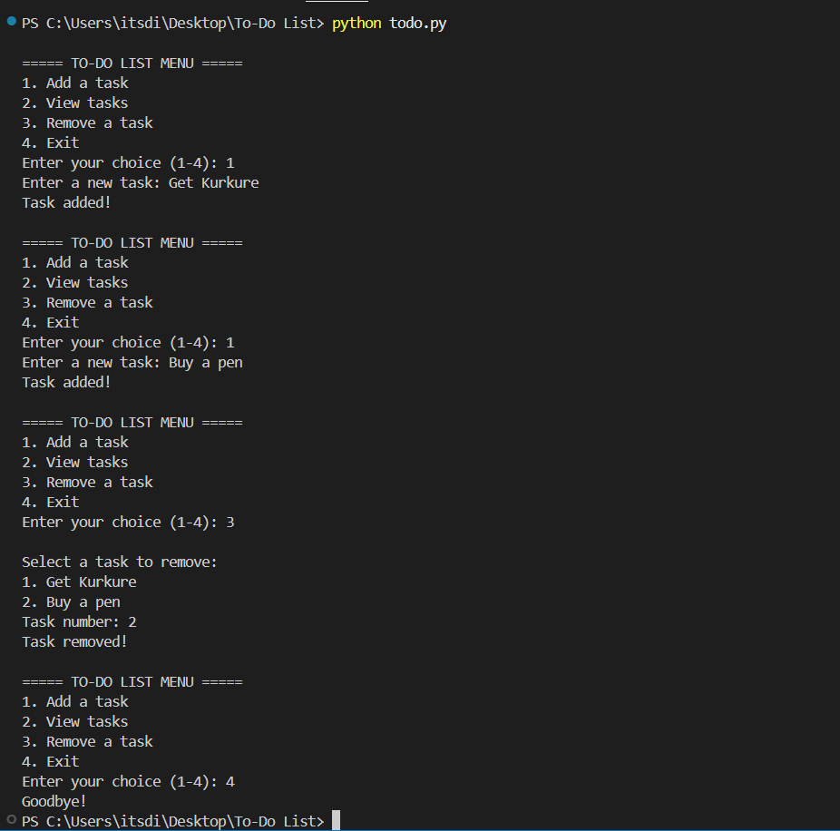
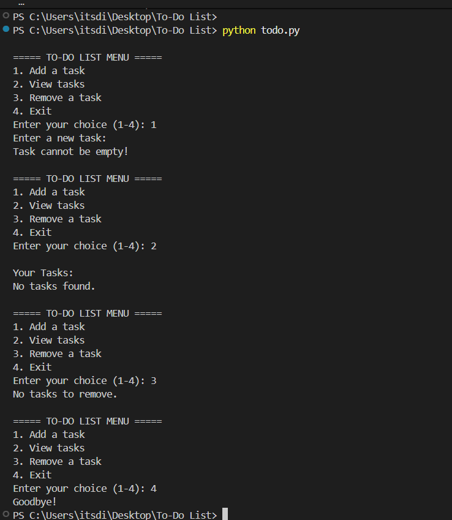

# To-Do List Application (Python)

A simple console-based To-Do List application built in Python.  
This program allows users to manage tasks efficiently with a clean and intuitive interface. It demonstrates basic programming concepts, error handling, and the use of Git for version control.

## Output Installation Screenshots





## Features
- Add new tasks with input validation
- View all current tasks
- Remove tasks safely with error handling
- Handles invalid inputs gracefully
- Maintains a simple, easy-to-use console interface

## Installation & Usage
1. Make sure Python is installed on your system.  
   - Download from [python.org](https://www.python.org/) if needed.  
2. Clone or download this repository.  
3. Open a terminal and navigate to the project folder.  
4. Run the program:

```bash
python todo.py

